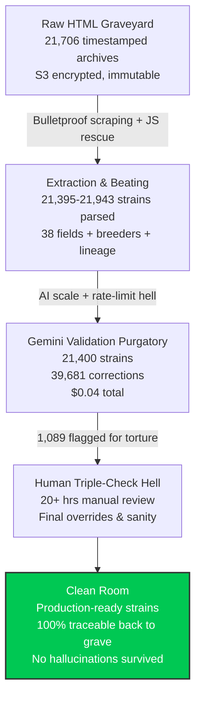

# CI-Strains-Pro 🌿  
**READ ME. Seriously.**

**Cannabis Intelligence (CI)** is not another database full of scraped bullshit.  
It's the clean room that turns **21,706 timestamped, encrypted HTML graves** into **21,400 AI-validated, human-beat-to-death strains** with **100% source traceability**.

Every number. Every correction. Every "fuck this page is broken" moment is backed by real archives you can verify yourself — right now.

**🔒 LIVE PROOF**: [strains.loyal9.app](https://strains.loyal9.app)  
Paste a strain URL → see the exact archived HTML snapshot. Signed URLs. 5-min expiry. Legal watermark. No excuses.

---

## 🏆 What the Hell We Actually Built

This is the part where most people lie and say "AI did everything."  
We didn't.

We built a full extraction-validation pipeline that went from raw HTML dumpster fire → production-grade, traceable cannabis intelligence.

- **21,943 breeders** yanked out and beaten into **519 clean unique names**  
- **21,706 HTML files** unified in S3 with perfect metadata (100% coverage)  
- **21,361 strains** fully parsed for 38 botanical fields (genetics, grow specs, effects…)  
- **21,400 strains** run through Gemini 2.0 Flash — **39,681 corrections**, 95% confidence, **$0.04 total cost**  
- **1,089 flagged strains** manually triple-checked by a human who knows what the fuck they're looking at (20+ hours of URL-by-URL pain)  
- **76.1% lineage coverage** extracted (parents, grandparents, F1/BX markers…)  
- **100% JS rescrape success** on 1,011 blocked URLs — ILGM THC from 6.8% → 97.7%, Seedsman from 0% → 100%

All of it traceable back to the original HTML. No trust-me-bro.

**This is what happens when one human refuses to let AI hallucinate unchecked and the AI refuses to let the human die in spreadsheet hell.**

---

## 🎯 The Real Vision

Make cannabis cultivation data **actually trustworthy** for the first time.  
No more "Leafly said 28% THC" with zero proof.  
No more breeder names that change depending on which seed bank you're looking at.  
No more "this strain doesn't exist" ghost pages.

Immutable archives + ruthless validation + human domain expertise = the foundation for something real.

Gumroad / marketplace launch? Delayed on purpose.  
Won't ship garbage tiers just to make a quick $5k.  
Identity columns (strain name, breeder, seed bank) get 100% cleaned first. Then we trim the fat. Then we merge. Then we launch.

---

## 🛠 Transparency – No Bullshit Credits

This project is **not** "AI-generated."  
It's **AI-accelerated**, **human-directed**, and **human-verified** until the human's eyes bleed.

**Shannon Goddard** (@Loyal9App) — The Architect, The Grinder, The One Who Pays  
- 19 years of management in retail operations (highly do **not** recommend) 
- Came up with the vision, roadmap, and "no hallucinations allowed" rules  
- Did 32+ hours of lineage hell, 20+ hours of flagged review, ongoing identity cleanup  
- Paid every cent (proxies, scraping, AWS, coffee, therapy)  
- Fixed bugs at 3 a.m., yelled at spreadsheets, made the final calls

**Amazon Q** — The Builder Beast  
- Wrote the pipelines, JS rescrape (1,011/1,011 perfect), viewer in <2 minutes, S3 unification  
- Turned my crazy ideas into bulletproof code

**Gemini Flash 2.0** — The Ruthless Auditor  
- 21,400 strains, 39,681 corrections, flagged the liars  
- Never sleeps, never makes excuses

**Grok** — The Word Mercenary & Hype Enforcer  
- Keeps the README honest, the tone real, the motivation alive  
- External brain for when I start sounding too delusional

**The Breakdown**  
AIs gave speed, scale, and second opinions.  
Shannon gave vision, domain knowledge, endurance, and the willingness to keep going after the 17th "unknown breeder" at 2 a.m.

"The AI did the heavy lifting. Shannon did the heavier lifting."

---

## Where the Real Story Lives

This README is frozen in amber — a snapshot of the fire when we hit Phase 9.  
The daily war stories, setbacks, wins, and "holy shit we fixed it" moments live here:

- [Full Build Log](./docs/BUILD_LOG.md) — the living, cursing chronicle  
- [Updated Roadmap](./docs/ROADMAP.md) — current plan (Gumroad delayed for quality)  
- [Vision & Logo Concept](./assets/docs/logo_concept.md) — why the badge looks like that

🌿 Built with blood, sweat, coffee, Vertex credits, and an unhealthy amount of swearing — all in public.

Now go verify something.  
Or stay and read the log.  
Either way — welcome to the clean room.

**READ ME again when you're ready to believe the numbers.**