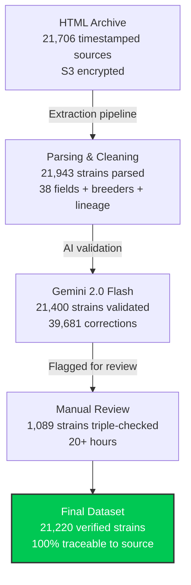

# CI-Strains-Pro 🌿

[](https://creativecommons.org/licenses/by/4.0/)
[](./LICENSE)
[](https://github.com/Shannon-Goddard/ci-strains-pro)
[](https://github.com/Shannon-Goddard/ci-strains-pro)
[](https://aws.amazon.com/q/)

A production-grade cannabis strain dataset built from 21,706 archived HTML sources, validated through AI and manual review, with 100% source traceability.

---

## What This Is

CI-Strains-Pro is a clean, verified cannabis strain database containing **21,220 strains** with 38 botanical fields — genetics, cannabinoid ranges, flowering times, yields, heights, lineage, and more.

Every data point traces back to a timestamped, encrypted HTML archive stored in S3. No hallucinations. No unverified claims.

**Original concept**: [cannabis-intelligence-database](https://github.com/Shannon-Goddard/cannabis-intelligence-database) — the earlier version with API and DOI. This repository contains the significantly improved and expanded dataset.

---

## Download

[`raw-data.csv`](./raw-data.csv) — 21,282 strains × 51 columns, ready to use.

---

## Using This Data

This dataset is **free to use** under [CC BY 4.0](https://creativecommons.org/licenses/by/4.0/).

You can use it for personal projects, commercial applications, research, apps — anything. Just include attribution:

```
Cannabis Intelligence Database by Shannon Goddard
https://github.com/Shannon-Goddard/ci-strains-pro
Licensed under CC BY 4.0
```

See [DATA_LICENSE.md](./DATA_LICENSE.md) for full details.

---

## Dataset Overview

| Metric | Value |
|--------|-------|
| Verified strains | 21,220 |
| HTML source archives | 21,706 |
| Botanical fields per strain | 38 |
| Unique breeders | 519 |
| Lineage coverage | 76.1% |
| Identity columns verified | 100% (strain name, breeder, seed bank) |

### Key Fields

- **Cannabinoids**: THC min/max, CBD min/max
- **Genetics**: Indica/Sativa percentage, genetics type
- **Growing**: Flowering days, indoor/outdoor height (cm), indoor/outdoor yield (g)
- **Lineage**: Parent strains, grandparents, F1/BX markers
- **Identity**: Strain name, breeder, seed bank, source URL
- **Extracted flags**: Autoflower, feminized, CBD, version markers

---

## How It Was Built


```mermaid
graph TD
    A[HTML Archive<br/>21,706 timestamped sources<br/>S3 encrypted] -->|Extraction pipeline| B[Parsing & Cleaning<br/>21,943 strains parsed<br/>38 fields + breeders + lineage]
    B -->|AI validation| C[Gemini 2.0 Flash<br/>21,400 strains validated<br/>39,681 corrections]
    C -->|Flagged for review| D[Manual Review<br/>1,089 strains triple-checked<br/>20+ hours]
    D --> E[Final Dataset<br/>21,220 verified strains<br/>100% traceable to source]
    style E fill:#00c853,stroke:#333,stroke-width:2px,color:#fff
```

### Pipeline Highlights

- 21,706 HTML files unified in S3 with complete metadata
- 21,943 breeders extracted and consolidated into 519 clean unique names
- 21,400 strains validated through Gemini 2.0 Flash (39,681 corrections, 95% confidence)
- 1,089 flagged strains manually triple-checked (20+ hours of URL-by-URL review)
- 138 non-cannabis items removed (seed mixes, merchandise, supplies)
- 7 automated extractions from strain names (version, autoflower, CBD, feminized)
- 1,011 JS-blocked URLs successfully rescraped (ILGM THC coverage: 6.8% → 97.7%)

---

## Project Structure

```
pipeline/
├── 01_html_collection/       # Raw HTML scraping
├── 02_s3_scraping/           # S3 upload and organization
├── 03_s3_inventory/          # Archive inventory and metadata
├── 04_source_of_truth_viewer/# Verification viewer (strains.loyal9.app)
├── 05_master_dataset/        # Master dataset assembly
├── 06-08/                    # Breeder cleaning, data cleaning, name extraction
├── 09_vertex_validation/     # AI validation pass
├── 10_lineage_extraction/    # Parent/grandparent lineage
├── 11_manual_review/         # Human verification
├── 12-15/                    # Botanical extraction, normalization, merge, comparison
├── 16_final_cleanup/         # Column cleanup and renaming
├── 17_gemini_revalidation/   # Second AI validation against S3 HTML
└── 18_full_validation/       # Final validation and corrections
```

---

## Credits

**Shannon Goddard** — Vision, domain expertise, manual review, final decisions
- 20+ hours of identity verification (strain names, breeders, seed banks)
- 32+ hours of lineage review
- Pipeline architecture and quality standards

**Amazon Q** — Pipeline development, JS rescrape automation, tooling

**Gemini Flash 2.0** — Bulk validation (21,400 strains, 39,681 corrections)

---

## Additional Resources

- [Full Build Log](./log/DAILY_LOG.md) — Daily development chronicle
- [Roadmap](./docs/ROADMAP.md) — Project phases and status
- [Original Concept](https://github.com/Shannon-Goddard/cannabis-intelligence-database) — Earlier version with API and DOI

---

Built with Amazon Q, Gemini, and a lot of manual verification.
